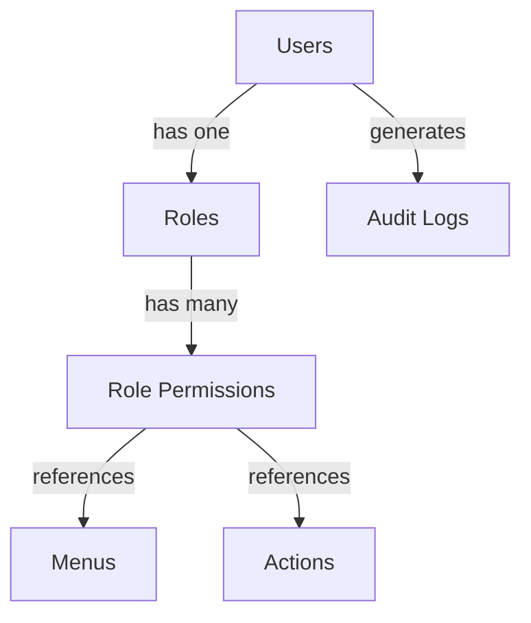
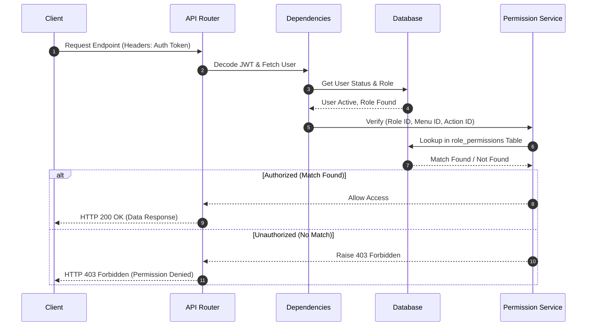

# AuthBase API - Architecture & Permission Guide

This document describes the system architecture, database schema, permission engine, and integration guidelines for the Role-Based Access Control (RBAC) implementation.

---

## 1. System Overview

The authorization model relies on a five-layer security hierarchy resolving user requests.

### Entity Relationships

To illustrate the relationship flow without messy ASCII blocks, the structure uses Markdown Mermaid diagrams.



Each permission grant dynamically associates a **Role** to a specific **Action** on a target **Menu** (e.g. `admin` role can perform the `create` action on the `Users` menu). Additionally, state changes produce immutable logs in the `Audit Logs` system for compliance tracking.

---

## 2. Database Schema

The system uses seven tables to persist user identities, authorization configurations, and system access history.

### Table Schema Definition

* **`roles`:** `id` (PK), `role_name` (Unique), `description`, `created_at`, `updated_at`.
* **`users`:** `id` (PK), `role_id` (FK), `name`, `email` (Unique), `password`, `phone`, `address`, `status`, `created_at`, `updated_at`.
* **`audit_logs`:** `id` (PK), `user_id` (FK), `module`, `activity`, `ip_address`, `user_agent`, `created_at`.
* **`menus`:** `id` (PK), `parent_id` (FK, Nullable), `menu_name`, `menu_slug` (Unique), `menu_url`, `icon`, `sort_order`, `is_active`, `created_at`, `updated_at`.
* **`actions`:** `id` (PK), `action_name` (Unique), `description`, `created_at`.
* **`role_permissions`:** `id` (PK), `role_id` (FK), `menu_id` (FK), `action_id` (FK), `created_at`.

### Entity Relationship Details
* **Roles (1 to N) Users:** A user has one role.
* **Roles (1 to N) RolePermissions:** A role maps to multiple permission grants.
* **Menus (1 to N) RolePermissions:** A menu maps to multiple permission grants.
* **Actions (1 to N) RolePermissions:** An action maps to multiple permission grants.
* **Menus (Self-referential 1 to N):** A menu can contain child submenus (hierarchical tree).
* **Users (1 to N) AuditLogs:** A user generates log history.

---

## 3. Permission Engine

Permissions resolve dynamically against a 3D intersection mapping a User's assigned Role to a specific Menu and Action.

### Evaluation Lifecycle



---

## 4. Developer Reference: Implementing Access Controls

### 4.1 Route Decoration (FastAPI Dependency)
Decorate routes using the `require_permission` dependency. This checks if the authenticated user's role has a grant mapping the specified `menu_id` and `action_id`.

```python
from fastapi import APIRouter, Depends
from sqlalchemy.orm import Session
from app.api.deps import get_db, require_permission

router = APIRouter()

@router.post("/items", dependencies=[Depends(require_permission(menu_id=2, action_id=1))])
def create_item(db: Session = Depends(get_db)):
    # Handled only if the user has action_id=1 (Create) on menu_id=2 (Users/Items)
    return {"status": "created"}
```

Alternatively, restrict endpoints strictly using role verification when menu-action logic is too granular:
```python
from app.api.deps import require_role

@router.get("/admin-only")
def get_system_metrics(_ = Depends(require_role("admin"))):
    return {"metrics": "system"}
```

### 4.2 Dynamic Permission Checking
Execute manual checks inside services or utilities using the `RolePermissionService`:

```python
from app.services.role_permission_service import RolePermissionService

def process_transaction(db: Session, current_user: User):
    has_perm = RolePermissionService.check_permission(
        db,
        role_id=current_user.role_id,
        menu_id=7,  # e.g., Settings menu
        action_id=3  # e.g., Update action
    )
    if not has_perm:
        raise HTTPException(status_code=403, detail="Unauthorized transaction attempt")
```

### 4.3 Frontend Integration Flow
Clients should query permissions on login to shape UI rendering:
1. Authenticate user to receive JWT.
2. Request permissions for the user's role: `GET /role-permissions/role/{role_id}`.
3. Map the permissions in state (`{ menu_id, action_id }`).
4. Toggle visibility of buttons or panels based on mapping presence:
   ```javascript
   function canPerform(menuId, actionId) {
     return permissions.some(p => p.menu_id === menuId && p.action_id === actionId);
   }

   // Render logic:
   {canPerform(2, 1) && <button onClick={handleCreate}>Create User</button>}
   ```

---

## 5. Security & Verification Layers

1. **Authentication (JWT Layer):** Decodes Bearer token, validates signature, ensures expiration time is valid, and retrieves user record.
2. **Status Check:** Explicitly checks user state. Suspended or inactive users are rejected immediately with `HTTP 401`.
3. **Role Validation:** Enforces correct active role assignment on requested actions.
4. **Action Authorization:** Inspects the matrix (`role_permissions` mapping).
5. **Audit Trail Logging:** All state changes produce an entry in `audit_logs` capturing user identification, module scope, activity description, client IP address, and browser User-Agent.
